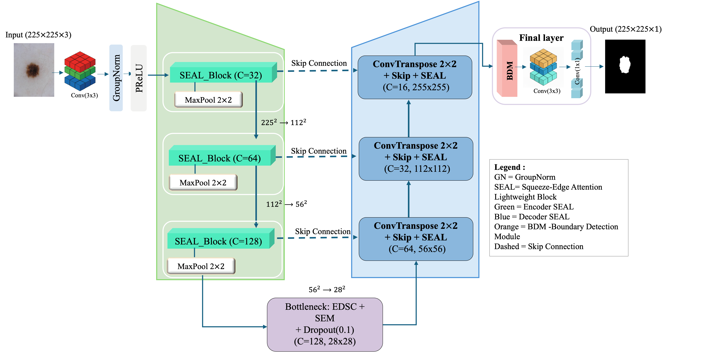

# ULS-Net: A Boundary-Semantic Decoupled Network for Ultra-Lightweight Skin Lesion Segmentation

## Overview

ULS-Net (ULtra-Lightweight Segmentation Network) is a boundary-semantic decoupled architecture for skin lesion segmentation targeting resource-constrained clinical deployment — primary care offices, rural clinics, and mobile health platforms. The model achieves **0.16M Parameters | 1.85 GFLOPs | 3.0ms Inference Time**, making it 7.2× smaller than the next-smallest comparable model while attaining the best F1-score and mIoU on two of three benchmarks.

## Architecture



ULS-Net follows a U-shaped encoder-decoder with a **division-of-labour** design: semantic feature extraction and boundary refinement are assigned to separate specialised components, rather than forcing a single encoder to handle both within a tight parameter budget.

```
Input (225×225×3)
    ↓  Stem: Conv3×3 → GroupNorm → PReLU  [16 ch]
    ↓
    Encoder 1: SEAL Block → MaxPool   [32 ch, 112×112]
    Encoder 2: SEAL Block → MaxPool   [64 ch,  56×56 ]
    Encoder 3: SEAL Block → MaxPool   [128 ch, 28×28 ]
    Bottleneck: SEAL Block + Dropout  [128 ch, 28×28 ]
    ↓
    Decoder 3: Concat + SEAL Block    [64 ch,  56×56 ]
    Decoder 2: Concat + SEAL Block    [32 ch, 112×112]
    Decoder 1: Concat + SEAL Block    [16 ch, 225×225]
    ↓
    BDM → Conv1×1 → Output mask      [1 ch,  225×225]
```

## Key Modules

**SEAL Block — Squeeze-Edge Attention Lightweight Block**
The fundamental building unit of both encoder and decoder. Integrates three components:
- **EDSC (Enhanced Depthwise Separable Convolution)**: factorises standard convolutions into depthwise + pointwise operations with GroupNorm and PReLU, reducing parameters ~7.9× versus standard convolutions
- **SEM (Squeeze-and-Excitation Module)**: channel attention via global average pooling → FC bottleneck (reduction ratio r=8) → sigmoid recalibration, compensating for representational loss in the compact channel space
- **Residual connection**: preserves gradient flow and identity mappings during early training

Because the BDM handles boundary preservation, the SEAL block focuses entirely on semantic features — allowing the SEM to amplify discriminative channel responses without being tasked with compensating for lost edge information.

**BDM — Boundary Detection Module**
Fixed-weight boundary detector applied at full resolution on the final decoder output. Uses two complementary operators at σ=1.0:
- **DoG (Difference of Gaussian)**: band-pass filter sensitive to step edges
- **LoG (Laplacian of Gaussian)**: sensitive to closed contours and fine textural transitions

Each operator output passes through 1×1 conv → PReLU → GroupNorm; both are fused via element-wise multiplication (emphasising locations where both operators agree), followed by 3×3 max pooling and a 1×1 conv refinement with residual connection. The BDM adds only **0.75K learnable parameters** and requires no edge supervision — it captures high-frequency boundary information at near-zero parameter cost using deterministic, mathematically well-understood operators.

## Loss Function

Composite loss combining pixel-level and region-based objectives:

$$\mathcal{L}_\text{total} = \mathcal{L}_\text{BCE} + \alpha(\mathcal{L}_\text{Dice} + \mathcal{L}_\text{IoU})$$

α follows an annealing schedule: initialised at 0.8, reduced by 0.2 every 70 epochs. Early training emphasises region-level Dice and IoU losses (robust to class imbalance); later training shifts toward pixel-level BCE for boundary precision.

## Results

### ISIC-2017 and ISIC-2018

| Model | ISIC-2017 F1 | ISIC-2017 mIoU | ISIC-2018 F1 | ISIC-2018 mIoU | Params |
|-------|-------------|----------------|-------------|----------------|--------|
| EMCADNet-b0 | **0.8168** | **0.8081** | 0.8647 | 0.8314 | 3.92M |
| CMUNeXt | 0.8162 | 0.8034 | 0.8375 | 0.8134 | 3.15M |
| Rolling-UNet-S | 0.7874 | 0.7801 | 0.8508 | 0.8220 | 1.78M |
| UNeXt | 0.7932 | 0.7860 | 0.8563 | 0.8292 | 1.47M |
| ShuffleNetV2 | 0.8002 | 0.7899 | 0.8504 | 0.8256 | 1.38M |
| LightM-UNet | 0.7415 | 0.7490 | 0.7878 | 0.7628 | 1.15M |
| **ULS-Net (ours)** | 0.7978 | 0.7989 | **0.8693** | **0.8408** | **0.16M** |

### PH2

| Model | Recall | Precision | F1 | mIoU | Params |
|-------|--------|-----------|----|----|--------|
| EMCADNet-b0 | 0.8216 | 0.6442 | 0.6396 | 0.5847 | 3.92M |
| CMUNeXt | 0.8912 | 0.9136 | 0.8873 | 0.8271 | 3.15M |
| Rolling-UNet-S | 0.9318 | 0.8930 | 0.9022 | 0.8383 | 1.78M |
| UNeXt | 0.8773 | **0.9536** | 0.9079 | 0.8514 | 1.47M |
| ShuffleNetV2 | 0.9020 | 0.9330 | 0.9080 | 0.8543 | 1.38M |
| LightM-UNet | 0.9274 | 0.8825 | 0.9017 | 0.8382 | 1.15M |
| **ULS-Net (ours)** | **0.9355** | 0.9443 | **0.9379** | **0.9040** | **0.16M** |

ULS-Net achieves the best F1 and mIoU on ISIC-2018 and PH2, outperforming models with up to 24× more parameters. On ISIC-2017, it achieves the highest Precision (0.9227) across all models.

### Model Complexity

| Model | Params (M) | FLOPs (G) | Time/Image (ms) |
|-------|-----------|-----------|-----------------|
| EMCADNet-b0 | 3.92 | 1.28 | 15.8 |
| CMUNeXt | 3.15 | 11.28 | 7.9 |
| Rolling-UNet-S | 1.78 | 3.22 | 26.8 |
| UNeXt | 1.47 | **0.87** | 5.3 |
| ShuffleNetV2 | 1.38 | 2.20 | 8.7 |
| LightM-UNet | 1.15 | 4.28 | 30.2 |
| **ULS-Net (ours)** | **0.16** | 1.85 | **3.0** |

ULS-Net is 7.2× smaller than the next-smallest model (LightM-UNet) and achieves the fastest inference time at 3.0ms/image — faster than all competitors including UNeXt (5.3ms) which has nearly 10× more parameters.

## Ablation Study (PH2)

| Variant | EDSC | SEM | BDM | F1 | mIoU | Params (K) | ΔmIoU |
|---------|------|-----|-----|----|------|-----------|-------|
| Baseline | ✓ | | | 0.9158 | 0.8771 | 125.54 | — |
| + SEM | ✓ | ✓ | | 0.9134 | 0.8774 | 161.18 | +0.03 |
| + BDM | ✓ | | ✓ | 0.9301 | 0.8957 | 126.29 | +1.86 |
| **ULS-Net (full)** | ✓ | ✓ | ✓ | **0.9312** | **0.8976** | 161.94 | **+2.05** |

The full model's +2.05% mIoU gain exceeds the sum of individual gains (+0.03% + +1.86% = +1.89%), confirming the division-of-labour principle: with boundary preservation handled by the BDM, the SEM focuses entirely on semantics, amplifying both components' effectiveness beyond their independent contributions.

## Requirements

- Python ≥ 3.7.5
- PyTorch ≥ 2.2.0
- OpenCV ≥ 4.9.0
- NumPy ≥ 1.26.4
- SciPy ≥ 1.11.4
- Matplotlib ≥ 3.8.0
- NVIDIA GPU with 8 GB VRAM

```bash
pip install torch torchvision opencv-python numpy scipy matplotlib
```

## Training

```bash
python code/main.py \
  --mode train \
  --dataset ISIC2018 \
  --image_size 225 \
  --batch_size 4 \
  --num_epochs 100 \
  --lr 1e-3
```

## Testing

```bash
python code/main.py \
  --mode test \
  --dataset ISIC2018 \
  --image_size 225
```

## Datasets

| Dataset | Total | Train | Validation | Test |
|---------|-------|-------|-----------|------|
| ISIC-2017 | 2,000 | 1,250 | 150 | 600 |
| ISIC-2018 | 3,694 | 2,594 | 100 | 1,000 |
| PH2 | 200 | 140 | 20 | 40 |

All images resized to 225×225. Ground-truth masks binarised at threshold 0.8.

## Citation

If you use this code in your research, please cite:

```bibtex
@misc{alharith2025ulsnet,
  title   = {{ULS-Net}: A Boundary-Semantic Decoupled Network for
             Ultra-Lightweight Skin Lesion Segmentation in
             Resource-Limited Clinical Settings},
  author  = {Alharith, Razan},
  year    = {2025},
  url     = {https://github.com/razanharith/ULS-Net}
}
```

## Contact

For questions about this research, contact Razan Alharith at razanalharith@my.swjtu.edu.cn.
